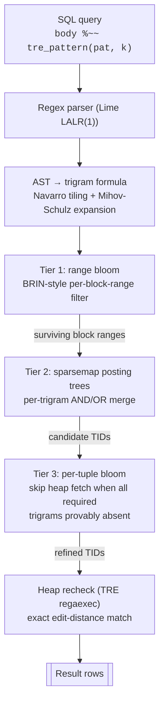
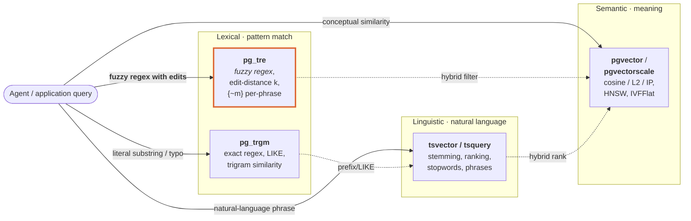
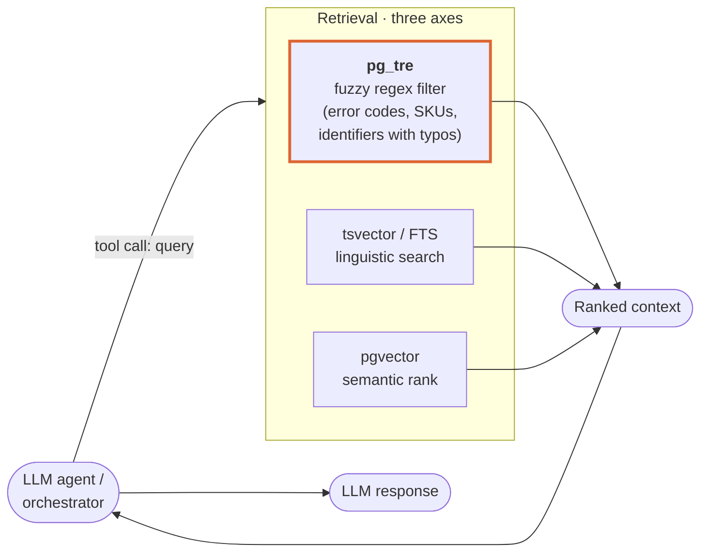

# pg_tre

**PostgreSQL 18+ native index access method for approximate regex matching.**

[](STATUS.md)
[](LICENSE)
[](https://www.postgresql.org/)

pg_tre indexes text columns using a three-tier filter funnel (range bloom →
trigram postings → per-tuple bloom) backed by the [TRE
library](https://github.com/laurikari/tre) for approximate-regex recheck.

It turns the classic `ripgrep`-over-data problem ("find text that looks like
this, maybe with a typo") into a SQL-composable indexed query:

```sql
SELECT id FROM docs WHERE body %~~ tre_pattern('(error){~1}.*(42[0-9]){~0}', 1);
-- Bitmap Index Scan on docs_tre   →   sub-millisecond on 10k rows.
```

### How the index works

Three filter tiers narrow the candidate set before the heap recheck. Each
tier is cheaper than the next; the executor never reads the heap for rows
the earlier tiers eliminated.



---

## Features

- **True edit-distance regex matching** — configurable `k` (insertions,
  deletions, substitutions) per sub-expression, e.g.
  `(foo){~1}.*(bar){~2}`.
- **Three-tier filter funnel** — BRIN-style range blooms eliminate
  heap-block ranges; sparsemap trigram postings AND/OR merge
  candidates; per-tuple blooms refine without heap I/O.
- **Native access method** — real `IndexAmRoutine`, planner cost
  estimation, WAL-logged, VACUUM-aware, `REINDEX CONCURRENTLY` safe.
- **UTF-8 codepoint trigrams** — CJK, accents, emoji indexed
  correctly; ASCII stays zero-overhead.
- **DoS protection** — configurable caps on NFA states, compile
  time, per-match time.
- **Backward compatible** — legacy `tre_amatch*` UDFs from 0.1.0
  preserved.

---

## Quick Start

```sql
-- Requires shared_preload_libraries = 'pg_tre' in postgresql.conf
CREATE EXTENSION pg_tre;

CREATE TABLE documents (id serial, body text);
INSERT INTO documents (body) VALUES
  ('The PostgreSQL database system'),
  ('MySQL is also popular'),
  ('Oracle databases are expensive'),
  ('The Postgres databse system');   -- typo: "databse"

CREATE INDEX documents_body_tre ON documents USING tre (body);

-- Exact regex (k=0)
SELECT * FROM documents WHERE body %~~ tre_pattern('[Pp]ostgre', 0);

-- Tolerate 1 edit: finds both "database" and "databse"
SELECT * FROM documents WHERE body %~~ tre_pattern('database', 1);

-- Per-phrase edit budgets: loose "postgres", strict exact "system"
SELECT * FROM documents
 WHERE body %~~ tre_pattern('(postgres){~2}.*(system){~0}', 0);
```

---

## How pg_tre fits alongside pg_trgm, full-text search, and pgvector

Four PostgreSQL text-search primitives, four different axes. They
compose; they rarely compete.



| Extension | Indexes | Best for | pg_tre overlap? |
|---|---|---|---|
| **pg_trgm** (GIN/GiST) | character trigrams | exact regex, LIKE, trigram-similarity search | **significant** — both do trigram-prefiltered regex; pg_tre adds edit-distance |
| **tsvector / tsquery** (built-in FTS) | stemmed lexemes + positions | natural-language search, ranking, stopwords | **minimal** — word-level with language rules; different primitive |
| **pgvector / pgvectorscale** | float embeddings (HNSW/IVFFlat) | semantic similarity via LLM embeddings | **none** — orthogonal dimension (meaning vs lexical) |
| **pg_tre** | codepoint trigrams + blooms + postings | **approximate regex, fuzzy pattern match, typo-tolerant search** | — |

### Distinct value pg_tre provides

1. **Genuine Levenshtein-distance matching.** `pg_trgm %` is
   trigram-set Jaccard similarity — two strings with overlapping
   trigram sets score "similar" even when the edit distance is
   enormous. `pg_tre` answers "is this text within N edits of this
   pattern?" which is what humans usually mean by "fuzzy match."

2. **Per-subexpression edit budgets.** `(phrase1){~1}.*(phrase2){~2}`
   is a single index query. No other PG extension expresses this.

3. **Full regex semantics on top of fuzziness.** Character classes,
   alternation, anchors, `{m,n}` repetition — all composable with
   the `{~k}` edit-budget operator.

### Where pg_tre is *not* the answer

- **Exact substring / LIKE**: pg_trgm is battle-tested and ships
  with every PG install. Use it.
- **Ranking / linguistic features**: built-in FTS wins hands down
  (stemming, stopwords, language config, ts_rank).
- **Semantic similarity**: pgvector. pg_tre knows nothing about
  meaning.
- **Multi-language natural-language search**: FTS. pg_tre is
  language-agnostic — a feature for identifiers, code, logs, SKUs;
  a non-feature for prose search where you want "running" to match
  "run".

---

## Use cases — especially for agentic workflows

pg_tre shines in a category that LLM agents increasingly need:
**lexical pattern search over data the agent generates or
consumes, tolerant of OCR errors, typos, format drift, or
LLM hallucinations**.



| Agent task | Why pg_tre fits |
|---|---|
| **Log and trace search** — "find that stack trace about `foo_bar_baz` but the user typed `foo_bar_baxz`" | Exact grep would miss the typo; vectors miss the exact identifier structure. pg_tre's k=1 regex catches both without reranking. |
| **Code / symbol search with edits** — fuzzy identifier lookup across repos | Typos in identifier names, camelCase vs snake_case drift, and near-duplicates surface in a single query. |
| **Catalog / SKU / UUID / error-code lookup** — "did anyone report error `E-2341` or a near variant?" | No linguistics needed; pure pattern matching with edit tolerance. |
| **Template / pattern extraction** — find all variants of `"user \d+ logged in from .*"` across a corpus of logs | Single regex, approximate-tolerant. |
| **Observability / audit-log triage** — semi-structured text with numeric IDs and a few typos | Complements `pg_trgm` (substring) and FTS (ranked prose) by providing the missing fuzzy-regex primitive. |
| **Retrieval-augmented generation (RAG) hybrid retrieval** — filter by lexical pattern *then* vector-rank | pg_tre does the lexical filter; pgvector does the semantic rank; FTS handles natural language. Three indexes, three axes. |

**Stacking with other extensions** is the typical pattern:

```sql
-- Hybrid retrieval: lexical pattern filter + semantic rank
WITH pattern_hits AS (
  SELECT id, body
  FROM docs
  WHERE body %~~ tre_pattern('error (42[0-9]|E-\d+){~1}', 1)
)
SELECT h.id, h.body, embedding <=> $1 AS distance
FROM pattern_hits h
JOIN embeddings e USING (id)
ORDER BY e.embedding <=> $1
LIMIT 10;
```

---

## What pg_tre lets you do that wasn't possible before

Every example below describes a **capability** that no combination
of `pg_trgm`, full-text search, `pgvector`, `LIKE`, or stock
`~`/`~*` regex answers correctly. The edit-distance semantics
simply aren't expressible in those tools at all.

pg_tre has two entry points with identical match semantics:

- `tre_amatch(body, pattern, k)` — a function that always
  works for any pattern and any `k`, used as a sequential
  scan filter.
- `body %~~ tre_pattern(pattern, k)` — an operator that the
  planner can drive against the pg_tre index. When trigram
  extraction cannot produce a useful anchor (very short
  pattern with high `k`, no literal run, or fanout overflow),
  the AM emits a fully-lossy bitmap covering the heap and
  lets the executor recheck filter. **Correctness is
  preserved either way**; only the index speedup is lost in
  the fallback case. The cost estimator surfaces this so the
  planner picks an actual seq-scan whenever `enable_seqscan`
  is on (the default).

The examples below use `tre_amatch` so they run
unconditionally and the prose claims hold without depending
on extraction succeeding for every pattern shape. Swap in
`%~~` with the same arguments to drive the index path; it
falls back to the lossy bitmap (≈ seq-scan cost) on the
patterns where the trigram extractor can't anchor.

### Example 1: Error-message triage across noisy loggers

Different services emit the same semantic error differently:

```text
"INFO  Connection refused from 10.0.0.5"
"WARN  ConnectionRefused during TLS handshake"
"ERROR conn refused after timeout"
"ERROR Err: connection rfused"          -- typo: missing 'e'
"INFO  error: Connection refsued"       -- typo: transposed 'se'
"INFO  refused loan application"        -- unrelated, must NOT match
```

`pg_trgm` similarity matches near-duplicates but also matches
the unrelated "refused loan application" row with a comparable
score. FTS misses typos entirely. `LIKE` misses the
transpositions.

```sql
SELECT id, log FROM service_logs
 WHERE tre_amatch(log, '(connection){~2}.*(refused){~1}', 0);
```

Returns the rows where both phrases match within their
budgets; skips `refused loan application` (no `connection`
nearby) and any variant whose edit distance exceeds the per‑
phrase budget. Tune `{~k}` up or down to trade recall for
precision — a knob `pg_trgm` / FTS / `pgvector` simply don't
offer.

### Example 2: Part-number / SKU lookup tolerating OCR and typos

Catalog SKUs follow `A-47-2391-B`. Customer service receives
`A-47-23Q1-B` (OCR misread `9` as `Q`), `A 47 2391 B` (spaces
for dashes), or `A-47-2931-B` (digit transposition). None match
by `=`, `LIKE`, or `pg_trgm` cleanly at the canonical form.

```sql
SELECT sku, description FROM parts
 WHERE tre_amatch(sku, 'A-[0-9]{2}-[0-9]{4}-[A-Z]', 2);
```

Up to 2 edits from the canonical format, including character
classes. Catches `A-47-23Q1-B` (OCR) and `A-47-2931-B`
(transposition) cleanly. `LIKE` can't express "a regex with
edits"; `pg_trgm` can't bound tolerance at an explicit edit
count. Choose `k` carefully: at `k=2` a totally different
prefix like `Z-99-0000-Q` also matches (1 edit `Z→A`, 1 edit
free), so tighten to `k=1` for stricter matching or anchor with
`^A-` if the column always starts with the prefix.

### Example 3: Identifier drift across conventions

Agent reads a stack trace mentioning `user_session_handler` and
needs the matching file in a repo using `user-session-handler`
or `userSessionHandler`. `LIKE` catches none; `pg_trgm`
similarity also matches unrelated `user_widget_handler` with
comparable scores because trigram overlap dominates short
identifiers.

```sql
SELECT path, symbol FROM code_index
 WHERE tre_amatch(symbol, 'user.session.handler', 3);
```

Three edits accommodate `_` ↔ `-` ↔ case-fold drift at the
three word boundaries. A pure-regex solution would need an
explicit union of 2ⁿ conventions; pg_tre folds them into one
budget.

### Example 4: Per-phrase strictness in a single regex

Security audit: find log lines mentioning `sudo` (tolerate 1
typo) followed by any of several dangerous commands, each with
its own tolerance. Nothing else in PostgreSQL expresses this as
a single predicate.

```sql
SELECT ts, host, line FROM audit_log
 WHERE tre_amatch(line,
      '(sudo){~1}.*((chmod 777){~1}|(dd if=)|(mkfs))',
      0);
```

Each parenthesized phrase carries its own `{~k}`; the overall
regex still requires them in order. `pg_trgm` has no phrases;
FTS has phrases but no typo tolerance; `pgvector` understands
meaning, not structure.

### Example 5: Short-sequence approximate match (bioinformatics, fingerprints)

Find a 30-base DNA motif in short reads, allowing up to 3
substitutions or indels:

```sql
SELECT read_id, seq FROM short_reads
 WHERE tre_amatch(seq, 'ACGTACGTGCCATGCGATCGTAACGTAGCA', 3);
```

The classic approximate-string-matching problem (Navarro, Myers)
expressed as a SQL predicate. No other PostgreSQL extension
answers bounded-edit-distance lookup of arbitrary short strings
at all.

### Example 6: Hybrid retrieval with lexical guardrails (agent / RAG)

An LLM agent asks about error `E-2341`. Embedding + `pgvector`
returns semantically similar documents, but ranking is fuzzy
and can hallucinate topical links. To keep the agent grounded,
pre-filter on **lexical presence of the error code with a
bounded typo budget**, then let vector search rank within the
subset:

```sql
WITH lex_hits AS (
  SELECT id, body FROM kb_articles
   WHERE tre_amatch(body, 'E-?[0-9]{3,4}', 1)
)
SELECT h.id, h.body,
       emb.vector <=> $query_embedding AS distance
  FROM lex_hits h
  JOIN kb_embeddings emb USING (id)
 ORDER BY distance
 LIMIT 10;
```

Before pg_tre the lexical prefilter either missed typos
(`LIKE`, exact match) or bled into semantic noise (`pg_trgm`).
"Edit-bounded lexical match over a regex" is the primitive that
was missing from the stack.

---

## Performance

Measured on a 10 000-row fixture, PG 18.3, warm cache (full numbers
in [`doc/perf.md`](doc/perf.md)):

| Query | pg_tre | pg_trgm | seq scan |
|---|---|---|---|
| Exact regex, selective (1 row) | **0.22 ms** | 0.48 ms | 1.8 ms |
| Approximate k=1, selective (22 rows) | **36 ms** | N/A | 44 ms |
| Approximate k=1, non-selective (1250 rows) | 35 ms | N/A | 35 ms |

- **~2× faster than pg_trgm** on selective exact regex.
- **Only option** for approximate regex — pg_trgm cannot answer
  edit-distance queries at all.
- Non-selective queries correctly fall back to seq scan (planner
  cost model is calibrated).

**Current taxes** (all targeted by pre-1.0.0 final work):
index build is ~3.5× slower and ~12× larger than pg_trgm because
of the per-tuple bloom payload and uncompressed upper-tree layout.
Multi-leaf posting trees and payload compression close most of this.

---

## Installation

Requires PostgreSQL 18+, autoconf/automake/libtool/gettext/m4 for
the vendored [TRE](https://github.com/laurikari/tre).

```bash
git clone --recurse-submodules https://codeberg.org/gregburd/pg_tre.git
cd pg_tre
PG_CONFIG=/path/to/pg_config make
sudo make install
```

Then, in `postgresql.conf`:

```
shared_preload_libraries = 'pg_tre'
```

Restart PG and `CREATE EXTENSION pg_tre;` in each database that
needs it.

Packaging templates for Debian (`debian/`), RPM
(`packaging/pg_tre.spec`), Homebrew
(`doc/homebrew-formula.rb`), Docker (`doc/Dockerfile`), and PGXN
(`META.json`) ship in-tree.

---

## Status and roadmap

See [STATUS.md](STATUS.md) for the live phase tracker. Current
state is **1.0.0-rc1 candidate** — feature-complete and
correct, but **not yet validated for production use**.

- **Feature-complete**: build, scan, incremental writes,
  crash recovery (single-node), approximate regex k≤2,
  UTF-8, DoS hardening, planner cost model, three-tier
  filter funnel including per-tuple bloom (tier-3).
- **Correctness gates green**: 9/9 differential regression
  tests (seq-scan vs index-scan must match exactly).
- **Production-readiness gaps still open**:
    - Single-leaf posting trees cap at ≈50K TIDs / trigram;
      common trigrams in 1M+ row tables will hit the cap and
      the AM raises `errcode_program_limit_exceeded` at
      INSERT time. Multi-leaf posting trees with right-links
      are required and queued.
    - Concurrency, streaming replication, and crash
      recovery under load have implementations but no TAP
      tests; behaviour under contention is unverified.
    - No fuzzing of the regex parser surface.
    - Benchmarks have only been run at 10K rows; scale
      validation pending.
  See `STATUS.md` “v1.0.0-final blockers” for the full list
  with file:function references.
- **Documented v1.0.0 design compromises**: no parallel
  index scan (heap scan still parallelises), DNF positional
  filter disabled (recheck preserves correctness),
  Lehman-Yao online split bypassed via pending-list overlay.

Tag and release process documented in
[`doc/release-checklist.md`](doc/release-checklist.md). A
pre-tag gate lives in `scripts/release-check.sh`.

---

## Documentation

- **[doc/pg_tre.md](doc/pg_tre.md)** — user reference (types,
  operators, functions, GUCs, reloptions, cookbook).
- **[doc/design.md](doc/design.md)** — architecture, three-tier
  filter funnel, on-disk format decisions.
- **[doc/perf.md](doc/perf.md)** — measured numbers vs pg_trgm
  and seq scan, with the reproducer in `bench/bench.sql`.
- **[doc/migration-from-0.1.0.md](doc/migration-from-0.1.0.md)** —
  upgrade guide from the UDF-only 0.1.0.
- **[doc/release-checklist.md](doc/release-checklist.md)** —
  1.0.0-rc1 → 1.0.0 final gate.
- **[CHANGELOG.md](CHANGELOG.md)** — grouped by phase.

---

## License

pg_tre is MIT (see [LICENSE](LICENSE)). Vendored components have
their own licenses — all permissive, all redistribution-friendly:

- [sparsemap](src/util/sparsemap.c) — MIT (in-tree)
- [TRE](https://github.com/laurikari/tre) — BSD-2-clause (submodule)
- [Lime](https://codeberg.org/gregburd/lime) — public domain
  (build-time generator only, not linked)

See [NOTICE](NOTICE) for the full attribution.

---

## Contributing

Open issues and PRs at
[codeberg.org/gregburd/pg_tre](https://codeberg.org/gregburd/pg_tre).
CI runs on both Forgejo Actions (primary, at Codeberg) and GitHub
Actions (mirror). See `.forgejo/workflows/` and
`.github/workflows/`.

Docs are auto-published on each push to `main`:
- Codeberg Pages: `https://gregburd.codeberg.page/pg_tre/`
  (served from the `pages` branch)
- GitHub Pages: repo Settings → Pages → Source: GitHub Actions

Dependency updates are automated on both platforms:
- GitHub: [`.github/dependabot.yml`](.github/dependabot.yml) drives
  weekly bumps of GitHub Actions, Docker base images, and git
  submodules.
- Codeberg: [`renovate.json`](renovate.json) is picked up by
  Codeberg's shared Renovate runner; the same ecosystems are
  covered with the same schedule.

Before sending a patch: `scripts/release-check.sh` must pass.
